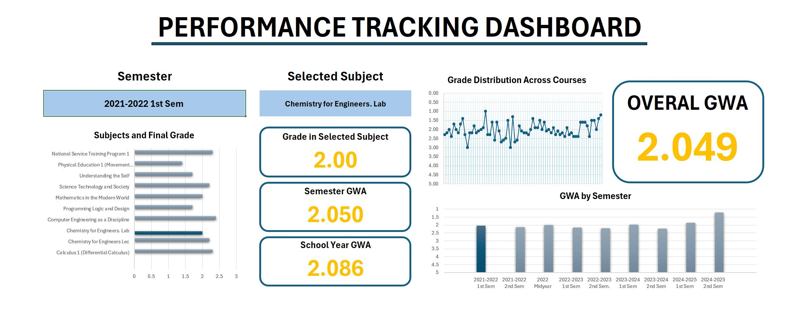

# 🎓 Grades Performance Dashboard (Excel)

This project showcases my **Performance Tracking Dashboard**, built entirely in **Microsoft Excel** to visualize my academic progress over multiple semesters.

---

## 📊 Preview

  

---

## 🧠 Features
- 📈 **GWA Tracking** – Automatically calculates semester and overall GWA.
- 📘 **Subject Analysis** – Displays grades per subject with dynamic visuals.
- 🎯 **KPI Cards** – Highlights key academic metrics like semester and year averages.
- 📅 **Trend Charts** – Shows GWA trend by semester and across all courses.
- 🧩 **Dynamic Filters** – Use drop-down lists to select semesters and subjects.

---

## 🛠️ Tools Used
- **Microsoft Excel**
  - Pivot Tables
  - Data Validation
  - Conditional Formatting
  - Charts and KPIs
- **Power Query** (for automation)

---

## 📁 File Information
- `GradesDashboard.xlsx` → Main dashboard
- `grades_per_subject`, `gwa_per_sem`, etc. → Supporting sheets for calculations

---

## 📬 Author
**Raven Bryle Hexter O. Riego**  
💻 Aspiring Data Analyst  
📧 riegoraven839@gmail.com  

---

⭐ *If you like this project, consider giving it a star on GitHub!*
